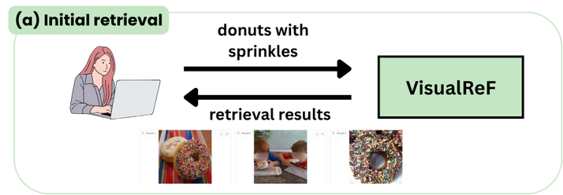
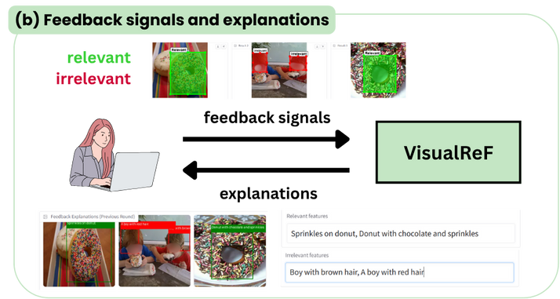
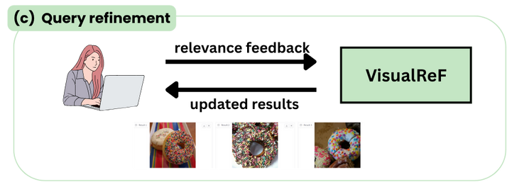

# VisualReF: Visual Relevance Feedback Prototype for Interactive Image Retrieval

VisualReFis the prototype of an interactive image search system based on visual relevance feedback.

The system that uses relevance feedback provided by the user to improve the search results. Specifically, the user can annotate the relevance and irrelevance of the retrieved images. These annotations are then used by image captioning model (currently, LLaVA-1.5 7b) to generate captions for image fragments from relevance feedback. These captions are then used to refine the search results using Rocchio's algorithm.

## Example of the use case:
(a) Input query and retrieved images:



(b) User annotates the relevance and irrelevance of the retrieved images and the system returns the explanation of the relevance (captioning results)



(c) User launches the refinement process and gets the updated search results:



Check more examples in the [assets](assets) folder.

## Configs:
- Captioning model and prompts: `configs/captioning/`. Prompts used to generate captions can be changed based on the use case and level of detail required. Advanced prompting techniques can be used to improve the quality of the captions.
- Demo: `configs/demo/`. Configs for the demo app: retrieval backbone (CLIP and SigLIP are currently supported), image database, and captioning model.

## Getting started

Python version: 3.11

We use venv for managing project dependencies.

```
python -m venv venv
source venv/bin/activate
pip install -r requirements.txt
```

## Data

We use two open-source datasets as use-cases for our demo:

1. General image search with COCO dataset:

    Data preparation: 
    ```
    mkdir data
    mkdir data/coco

    cd data
    wget http://images.cocodataset.org/zips/train2014.zip
    wget http://images.cocodataset.org/zips/val2014.zip
    wget http://images.cocodataset.org/zips/test2014.zip

    unzip train2014.zip -d coco/
    unzip val2014.zip -d coco/
    unzip test2014.zip -d coco/
    ```

    Build a faiss index with `clip-vit-large-patch14` for the test set:
    ```
    python write_faiss_index.py \
        --data data/coco/test2014 \
        --output faiss/coco/ \
        --batch_size 64 \
        --model_family clip \
        --model_id openai/clip-vit-large-patch14
    ```

    It is also possible to index the whole database (will take longer) with `--data data/coco/`.

2. Retail catalogue search with Retail-786k:
    Data preparation:
    ```
    wget https://zenodo.org/records/7970567/files/retail-786k_256.zip?download=1 -O retail-768k_256.zip

    unzip retail-786k_256.zip -d data/
    ```

    Build faiss index with `clip-vit-large-patch14`:
    ```
    python write_faiss_index.py \
        --data data/retail-786k_256/ \
        --output faiss/retail/test \
        --batch_size 64 \
        --model_family clip \
        --model_id openai/clip-vit-large-patch14
    ```

## Launch the prototype

- With image database based on COCO dataset and `clip-vit-large-patch14`:
    ```
    python -m demo.app \
        --config_path configs/demo/coco_clip_large.yaml \
        --captioning_model_config_path configs/captioning/llava_8bit.yaml 
    ```

- With image database based on Retail-786k dataset and `clip-vit-large-patch14`:
    ```
    python -m demo.app \
    --config_path configs/demo/retail_clip_large.yaml \
    --captioning_model_config_path configs/captioning/retail_llava_8bit.yaml 
    ```
